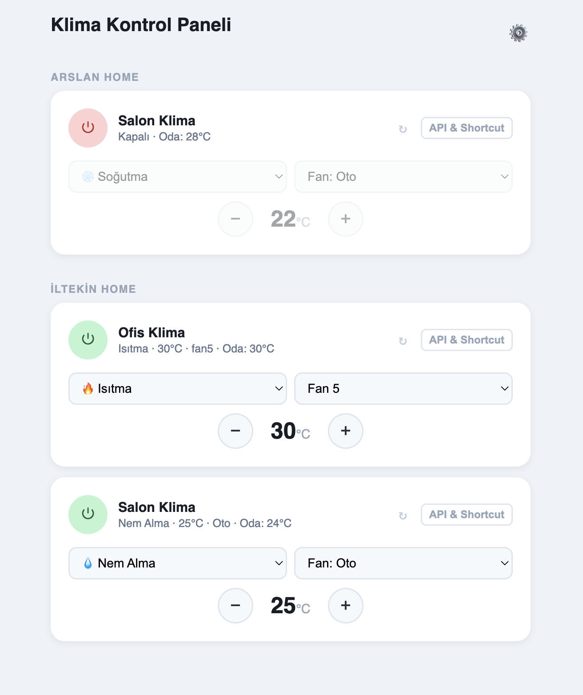
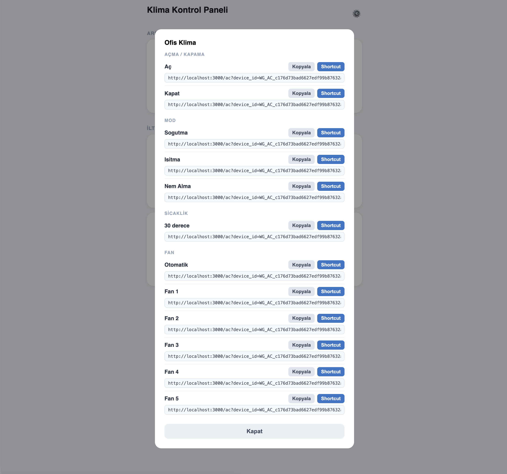
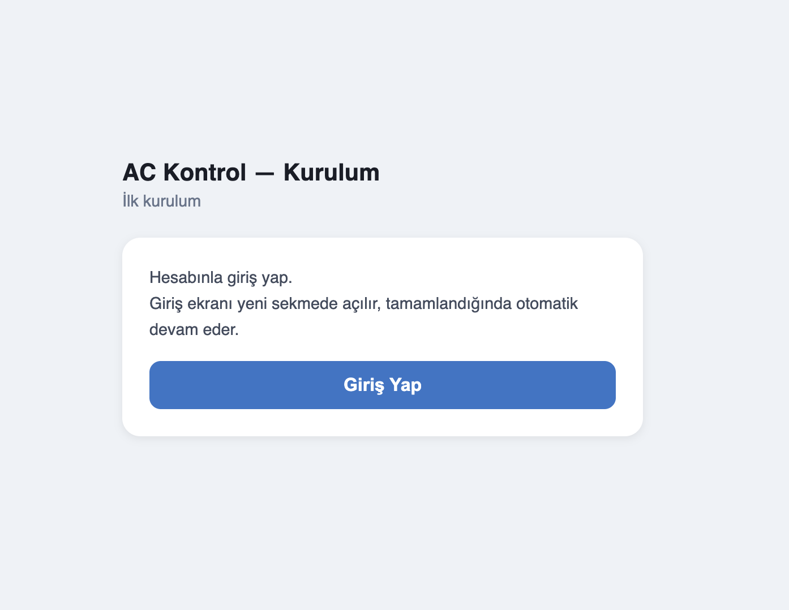

# Vestel Klima Uzaktan Kontrol

Vestel "Akıllı Yaşam" mobil uygulamasının API'si tersine mühendislik yöntemiyle analiz edilerek geliştirilmiş, kendi sunucunda çalışan klima kontrol paneli. Node.js ve Express ile yazılmıştır.

---

## Özellikler

- **Tam kontrol** — açma/kapama, mod (soğutma / ısıtma / nem alma), fan hızı (oto + 5 kademe), sıcaklık (18–30 °C)
- **Gerçek zamanlı durum** — cihaz durumu açılışta okunur, 30 saniyede bir güncellenir
- **Anlık tepki** — kontroller hemen yanıt verir, senkronizasyon arka planda gerçekleşir
- **Çoklu cihaz** — tüm evler ve cihazlar API'den otomatik çekilir, elle tanımlama gerekmez
- **Otomasyon** — belirli saatte veya oda sıcaklığı eşiğinde otomatik aç / kapat
- **Siri kısayolları** — her komut için hazır URL ve adım adım kurulum rehberi
- **API key koruması** — kendin belirlersin, üçüncü taraf hesap gerekmez

---

## Ekran Görüntüleri

| Ana Panel | API & Shortcut Modalı | Kurulum |
|:---:|:---:|:---:|
|  |  |  |

---

## Nasıl Çalışır

```
Tarayıcı → Bu sunucu → Vestel API → Klima
```

Sunucu, kurulum sihirbazından bir kez alınan OAuth tokenlarını saklar ve komutları Vestel'in REST API'sine iletir. ID token her saat otomatik yenilenir.

---

## Kurulum

```bash
git clone https://github.com/iltekin/vestel-ac-remote-control.git
cd vestel-ac-remote-control
npm install
cp .env.example .env   # düzenle
```

**Geliştirme ortamında:**
```bash
npm start
```

**Sunucuda (arka planda çalıştırmak için):**
```bash
npm install -g pm2
pm2 start server.js --name ac-control
pm2 save          # sunucu yeniden başladığında otomatik başlasın
```

---

## Yapılandırma

`.env.example` dosyasını `.env` olarak kopyala ve değerleri doldur:

```env
API_KEY=guclu-rastgele-bir-sifre
OAUTH_CLIENT_ID=vestel-uygulama-client-id
OAUTH_CLIENT_SECRET=vestel-uygulama-client-secret
PORT=3000
```

| Değişken | Açıklama |
|---|---|
| `API_KEY` | Panele ve API'ye erişimi koruyan parola — istediğin bir değer |
| `OAUTH_CLIENT_ID` | Vestel uygulamasının Cognito client ID'si |
| `OAUTH_CLIENT_SECRET` | Vestel uygulamasının Cognito client secret'ı |
| `PORT` | Dinlenecek port (varsayılan: `3000`) |

### OAUTH_CLIENT_ID ve OAUTH_CLIENT_SECRET nasıl bulunur

Bu değerler Vestel'in mobil uygulamasına ait AWS Cognito kimlik bilgileridir. Aynı markayı kullanan herkes için aynıdır; ancak kötüye kullanım ihtimaline karşı ve Vestel'in bu değerleri değiştirmesi durumunda tüm kurulumların bozulmaması için repoya dahil edilmemiştir.

**Bulma yöntemi:**

1. Bir HTTP proxy aracı ile mobil trafiği dinle (SSL inspection etkin olmalı)
2. Vestel Akıllı Yaşam uygulamasını aç ve giriş yap
3. `hosted-kimlik.vestel.com.tr/oauth2/token` isteğini bul
4. İstek gövdesindeki `client_id` ve `client_secret` değerlerini kopyala

ya da senden önce bulmuş olan birine sor 🙂

---

## İlk Giriş (OAuth Kurulumu)

Uygulama ilk kez çalıştırıldığında veya token süresi dolduğunda bir kez giriş yapılması gerekir.

### Yerel kurulumda (localhost)

1. `http://localhost:3000` adresini aç
2. `API_KEY` değerini gir — token yoksa otomatik olarak kurulum sayfasına yönlendirilirsin
3. **Giriş Yap** — Vestel hesabıyla giriş yapılır, token otomatik kaydedilir
4. Cihazlar otomatik listelenir

### Uzak sunucuda (prod)

OAuth callback'i `http://localhost:3000` adresine yönlendirilecektir. Bu adres sunucuda değil, yalnızca yerel makinelerde kayıtlıdır. Sunucuda kurulum yaparken şu adımları izle:

1. Sunucunun setup sayfasını aç (`https://sunucu-adresin.com/setup/`)
2. **Giriş Yap** — Google giriş ekranı yeni sekmede açılır
3. Google hesabıyla giriş yap
4. Tarayıcı `http://localhost:3000/?code=...` adresini açmaya çalışır — **sayfa yüklenmez, bu normaldir**
5. Adres çubuğundaki URL'yi kopyala
6. Setup sayfasına dön, kopyaladığın URL'yi yapıştır ve **Devam**'a tıkla
7. Token kaydedilir, panel açılır

### Refresh token ile manuel giriş

Mobil uygulama trafiğinden doğrudan refresh token elde ettiysen setup sayfasındaki "refresh token ile manuel giriş" seçeneğini kullanabilirsin. Redirect URL adımlarına gerek kalmaz.

---

## Token Yönetimi

Tokenlar `data/` klasöründe saklanır (git'e dahil değildir):

```
data/
├── token-cache.json   — önbelleğe alınmış ID token (1 saatlik)
└── refresh-token.txt  — otomatik yenileme için refresh token
```

ID token süresi dolduğunda refresh token ile otomatik yenilenir. Refresh token da süresi dolarsa (genellikle 30+ gün hareketsizlik sonrası) ⚙️ butonundan kurulum sihirbazını tekrar çalıştır.

---

## API

Tüm endpoint'ler `?api_key=KEY` sorgu parametresi veya `X-Api-Key` header'ı gerektirir.

### Cihazlar

```
GET /ac/devices
```

```json
[
  { "deviceName": "Salon Klima", "deviceId": "WG_AC_...", "homeName": "Ev" }
]
```

### Durum

```
GET /ac/status?device_id=DEVICE_ID
```

```json
{ "on": true, "mode": "cool", "fan": "fan2", "temp": 23, "roomTemp": 26 }
```

### Komutlar

```
GET /ac?device_id=DEVICE_ID&cmd=KOMUT[&parametre=deger]&api_key=KEY
```

| `cmd` | Ek parametre | Açıklama |
|---|---|---|
| `on` | `mode` (opsiyonel) | Aç. Varsayılan mod: `cool` |
| `off` | — | Kapat |
| `mode` | `mode=cool\|heat\|dry` | Mod değiştir (klima açık olmalı) |
| `fan` | `fan=auto\|fan1…fan5` | Fan hızı (klima açık olmalı) |
| `temp` | `temp=18…30` | Sıcaklık ayarla, °C (klima açık olmalı) |

**Başarı:**
```json
{ "ok": true, "code": "ACGENSI00001" }
```

**Hata:**
```json
{ "ok": false, "error": "Klima kapali. Once ac." }
```

---

## Otomasyon

Ana sayfanın altındaki **Otomasyonlar** bölümünden kural eklenebilir. İki tip desteklenir:

### Zamanlama

Belirli bir saatte ve seçili günlerde klima otomatik açılır veya kapanır.

- **Saat** — ör. `07:30`
- **Günler** — istediğin günleri seç; boş bırakırsan her gün çalışır
- **İşlem** — Aç (mod + opsiyonel sıcaklık) veya Kapat

### Sıcaklık Tetikleyici

Oda sıcaklığı belirlenen eşiği aştığında veya düştüğünde çalışır.

- **Koşul** — ör. oda sıcaklığı `>` `28` °C olduğunda
- **İşlem** — Aç (mod + opsiyonel sıcaklık) veya Kapat

Otomasyonlar `data/automations.json` dosyasında saklanır.

---

## Siri Kısayolları

Herhangi bir cihaz kartındaki **API & Shortcut** butonuna tıkla:

- Tüm komutların API URL'leri listelenir, kopyalanabilir
- Her komut için Siri kısayolu ekleme adımları gösterilir

Kısayol eklendikten sonra "Hey Siri, klimayı aç" gibi sesli komutlar arka planda URL'yi tetikler.

---

## Uyumluluk

Bu panel, AWS Cognito (Hosted UI, Google OAuth federation) ile kimlik doğrulama kullanan sistemler için tasarlanmıştır. `ACGENSI` / `ACTEMOT` komut kodlaması Vestel'e özgüdür; farklı bir marka için `lib/ac-commands.js` dosyasını uyarlamak gerekebilir.

---

## Geliştirici

[Sezer İltekin](https://x.com/sezeriltekin) tarafından geliştirilmiştir. Proje, [bu tweet](https://x.com/sezeriltekin/status/2069174425014927536) ile başladı.

Ulaşmak için: sezeriltekin@gmail.com

---

## Lisans

MIT
